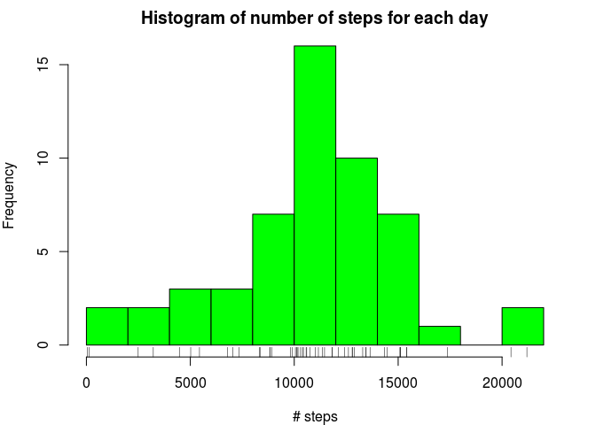
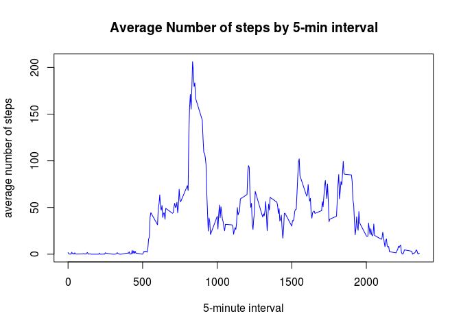
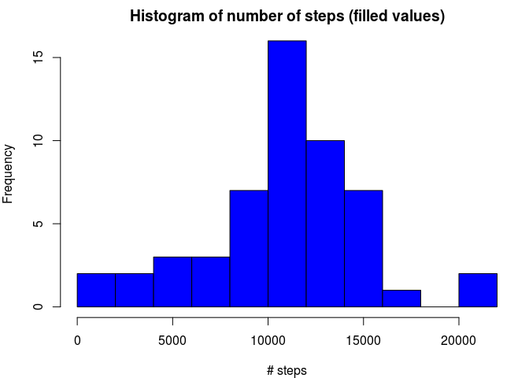
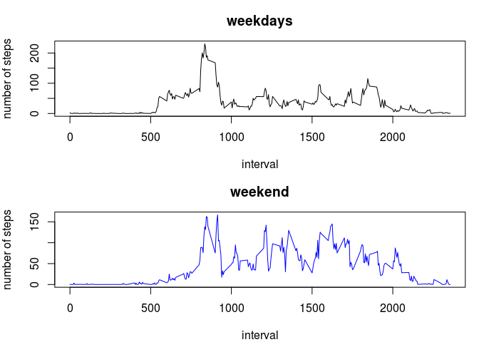

# Reproducible Research: Peer Assessment 1


by madoroi, at a Jun 22 23:56:36 2017


## Loading and preprocessing the data


```r
setwd("~/Desktop/datascience/5.reproducible_research/RepData_PeerAssessment1")
datas <- read.csv(unz("activity.zip", "activity.csv"))  
str(datas)
```

```
## 'data.frame':	17568 obs. of  3 variables:
##  $ steps   : int  NA NA NA NA NA NA NA NA NA NA ...
##  $ date    : Factor w/ 61 levels "2012-10-01","2012-10-02",..: 1 1 1 1 1 1 1 1 1 1 ...
##  $ interval: int  0 5 10 15 20 25 30 35 40 45 ...
```
The data shows shows a dataframe with three variables and 17568 observations. 
The variables included in this dataset are:

   - steps: Number of steps taking in a 5-minute interval (missing values are coded as NA)
   - date: The date on which the measurement was taken in YYYY-MM-DD format, in 61 days. 
   - interval: Identifier for the 5-minute interval in which measurement was taken

There are some missing values (NA) among the data. 

## What is mean total number of steps taken per day?

1. Total number of steps taken per day

```r
nstep <- sapply(split(datas$steps, datas$date), sum)
```

2. Histogram of the total number of steps taken each day

```r
par(mar=c(4,4,2,2))
hist(nstep, col = "green", main = "Histogram of number of steps for each day", xlab = "# steps", breaks = 10)
rug(nstep)
```

<!-- -->

3. Calculate and report the mean and median of the total number of steps taken per day

```r
mean1 <- mean(nstep, na.rm = TRUE)
median1 <- median(nstep, na.rm = TRUE)
```
The mean of total number of steps per day is 1.0766189\times 10^{4} and median equals 10765. 


## What is the average daily activity pattern?

1. Each day has 288 5-minute intervals, 12 for each hour. So, all the days are split by the ID interval and is made an average of all 288 intervals across all days and a plot is performed: 

```r
average_step <- sapply(split(datas$steps, datas$interval), mean, na.rm = TRUE)
plot(names(average_step), average_step, type = "l",main = "Average Number of steps by 5-min interval", 
                    xlab = "5-minute interval", ylab = "average number of steps", col="blue")
```

<!-- -->

It can be seen a higher number of steps near interval  is near 8AM, the time to go to work, and a less activity before the rise of the sun and later night, when is time to rest and sleep. 


2. Which 5-minute interval, on average across all the days in the dataset, contains the maximum number of steps?

```r
which.max(average_step)
```

```
## 835 
## 104
```
 So, the 104th 5-minute interval (labeled as 835) has the highest number of steps (note: a day has a total of 288 5-minute interval) and 104th interval is around 8AM (indicated by the first character of 835). So 835 is the name of the 104th interval in the dataframe.


## Imputing missing values

Note that there are a number of days/intervals where there are missing values (coded as NA).The presence of missing days may introduce bias into some calculations or summaries of the data.

1. Calculate and report the total number of missing values in the dataset (i.e. the total number of rows with NAs)

```r
sum(is.na(datas))
```

```
## [1] 2304
```


For missing values we Devise a strategy for filling in all of the missing values in the dataset. In this case we will use the average values for each 5-minute interval calculated in "average_step" to fill each correspondent 5-minute interval missing step value. 

1. We Create a new dataset that is equal to the original dataset but with the missing data filled in.

Copy of the original dataframe:

```r
datas2 <- datas  # copy the actual dataframe to be filled with estimated values for missing ones
```

Then we create a column steps2, a copy of steps but with missing data filled in: 


```r
for (i in 1:length(datas2$steps) ) {
     
            if (is.na(datas2$steps[i]) ) {
                  datas2$steps2[i] <- average_step[which(names(average_step)==datas2$interval[i])]
            }
            else {
                  datas2$steps2[i] <- datas2$steps[i]
            }
}
```

2. Make a histogram of the total number of steps taken each day and Calculate and report the mean and median total number of steps taken per day. 

It is computed a vector with the Total number of steps taken per day. Split is used to split the data by date and apply therefore the sum by each date. 

```r
nstep2 <- sapply(split(datas2$steps, datas2$date), sum)
```

Histogram of the total number of steps taken each day

```r
 par(mfrow = c(1, 1), mar = c(4, 4, 2, 1))
 hist(nstep2, col = "blue", main = "Histogram of number of steps (filled values)", xlab = "# steps", breaks = 10)
```

<!-- -->

3. Calculate and report the mean and median of the total number of steps taken per day

```r
mean2 <- mean(nstep2, na.rm = TRUE)
median2 <- median(nstep2, na.rm = TRUE)
```

The mean of total number of steps per day is 1.0766189\times 10^{4} and median equals 10765. 


4. Do these values differ from the estimates from the first part of the assignment? 
No, the values did not change because the filled in values were the average, which has no impact on the mean and median. 

5. What is the impact of imputing missing data on the estimates of the total daily number of steps?
The compared histogram shows that Imputing missing data ihas no impact on total daily number of steps. 


#Are there differences in activity patterns between weekdays and weekends?

1. It is created a new factor variable (datas2$wDay) in the dataset with two levels – “weekday” and “weekend” indicating whether a given date is a weekday or weekend day. It is used weekdays() function for this classification. 

- make the column data2$date a class date. 

```r
datas2$date <- as.Date(datas$date)
```

- create a vector of weekdays (system date is in portuguese language)

```r
week_days <- c('Segunda', 'Terça', 'Quarta', 'Quinta', 'Sexta')
```
- New variable (as a factor) with two levels, weekdays and weekend. 

```r
datas2$wDay <- factor( (weekdays(datas2$date ) %in% week_days), 
                   levels=c(FALSE, TRUE), labels=c('weekend', 'weekday') )
```
    

2. Average number of steps taken per interval and across weekdays and weekend

- Subset dataframes

```r
data_wday <- subset(datas2, wDay == "weekday")
data_wend <- subset(datas2, wDay == "weekend")
```
- Compute average steps for weekdays and weekend

```r
aver_wday <- sapply(split(data_wday$steps2, datas2$interval), mean)
```

```
## Warning in split.default(data_wday$steps2, datas2$interval): data length is
## not a multiple of split variable
```

```r
aver_wend <- sapply(split(data_wend$steps2, datas2$interval), mean)
```

```
## Warning in split.default(data_wend$steps2, datas2$interval): data length is
## not a multiple of split variable
```

3. Make a panel plot containing a time series plot (i.e. type = "l") of the 5-minute interval (x-axis) and the average number of steps taken, averaged across all weekday days or weekend days (y-axis).


```r
par(mfrow = c(2, 1), mar = c(4, 4, 3, 1))
plot(names(aver_wday), aver_wday, type="l", main = "weekdays", xlab = "interval", ylab = "number of steps") 
plot(names(aver_wend), aver_wend, type="l", main = "weekend", xlab = "interval", ylab = "number of steps", col = "blue") 
```

<!-- -->

It can be seen that for weekend this person has a more active day than weekdays. Perhaps this person has a passive job and in the working days the higher minutes are those when he moves to work (around 8AM). In the weekends he get up later but the intensity (physical movements) is much intense and he goes to bet later.  


```r
sessionInfo()
```

```
## R version 3.2.3 (2015-12-10)
## Platform: x86_64-pc-linux-gnu (64-bit)
## Running under: Linux Mint 18.1
## 
## locale:
##  [1] LC_CTYPE=pt_PT.UTF-8       LC_NUMERIC=C              
##  [3] LC_TIME=pt_PT.UTF-8        LC_COLLATE=pt_PT.UTF-8    
##  [5] LC_MONETARY=pt_PT.UTF-8    LC_MESSAGES=pt_PT.UTF-8   
##  [7] LC_PAPER=pt_PT.UTF-8       LC_NAME=C                 
##  [9] LC_ADDRESS=C               LC_TELEPHONE=C            
## [11] LC_MEASUREMENT=pt_PT.UTF-8 LC_IDENTIFICATION=C       
## 
## attached base packages:
## [1] stats     graphics  grDevices utils     datasets  methods   base     
## 
## loaded via a namespace (and not attached):
##  [1] backports_1.1.0 magrittr_1.5    rprojroot_1.2   tools_3.2.3    
##  [5] htmltools_0.3.6 yaml_2.1.14     Rcpp_0.12.10    stringi_1.1.3  
##  [9] rmarkdown_1.5   knitr_1.16      stringr_1.2.0   digest_0.6.12  
## [13] evaluate_0.10
```


